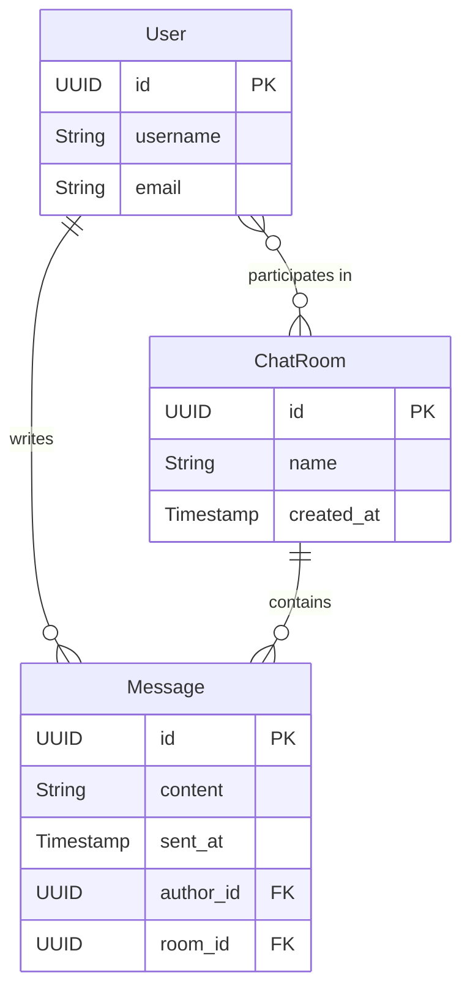
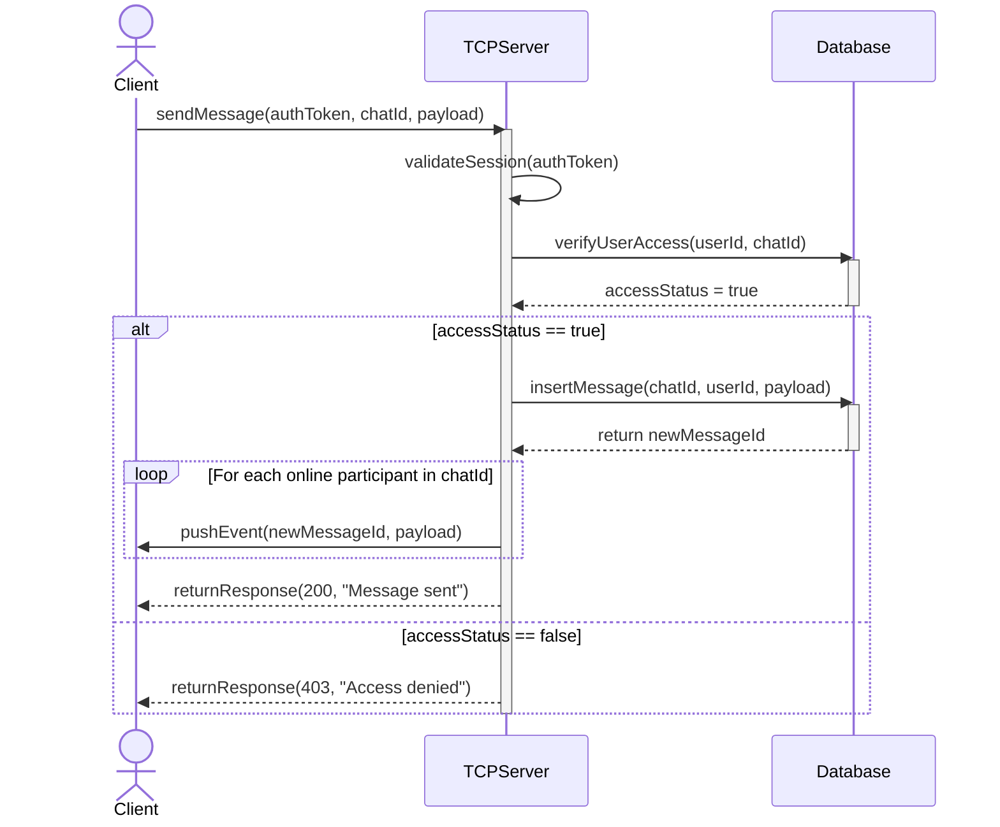
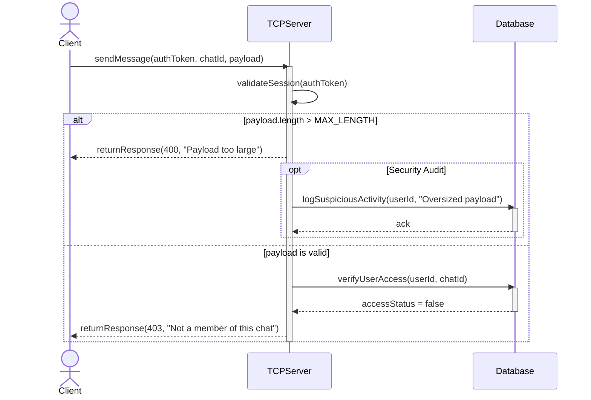

# ER-модель EchoLink

```mermaid
erDiagram
    User {
        UUID id PK
        String username
        String email
    }

    ChatRoom {
        UUID id PK
        String name
        Timestamp created_at
    }

    Message {
        UUID id PK
        String content
        Timestamp sent_at
        UUID author_id FK
        UUID room_id FK
    }

    User ||--o{ Message : "writes"
    ChatRoom ||--o{ Message : "contains"
    User }o--o{ ChatRoom : "participates in"
```

## Завдання 3: Sequence Diagrams (UC-01)

**Сценарій 1: Успішна відправка повідомлення**

```mermaid
sequenceDiagram
    actor Client
    participant TCPServer
    participant Database

    Client->>TCPServer: sendMessage(authToken, chatId, payload)
    activate TCPServer
    
    TCPServer->>TCPServer: validateSession(authToken)
    TCPServer->>Database: verifyUserAccess(userId, chatId)
    activate Database
    Database-->>TCPServer: accessStatus = true
    deactivate Database

    alt accessStatus == true
        TCPServer->>Database: insertMessage(chatId, userId, payload)
        activate Database
        Database-->>TCPServer: return newMessageId
        deactivate Database
        
        loop For each online participant in chatId
            TCPServer->>Client: pushEvent(newMessageId, payload)
        end
        
        TCPServer-->>Client: returnResponse(200, "Message sent")
    else accessStatus == false
        TCPServer-->>Client: returnResponse(403, "Access denied")
    end
    
    deactivate TCPServer
```
**Сценарій 2: Помилка валідації**

```mermaid
sequenceDiagram
    actor Client
    participant TCPServer
    participant Database

    Client->>TCPServer: sendMessage(authToken, chatId, payload)
    activate TCPServer
    
    TCPServer->>TCPServer: validateSession(authToken)
    
    alt payload.length > MAX_LENGTH
        TCPServer-->>Client: returnResponse(400, "Payload too large")
        
        opt Security Audit
            TCPServer->>Database: logSuspiciousActivity(userId, "Oversized payload")
            activate Database
            Database-->>TCPServer: ack
            deactivate Database
        end
        
    else payload is valid
        TCPServer->>Database: verifyUserAccess(userId, chatId)
        activate Database
        Database-->>TCPServer: accessStatus = false
        deactivate Database
        TCPServer-->>Client: returnResponse(403, "Not a member of this chat")
    end
    
    deactivate TCPServer
```