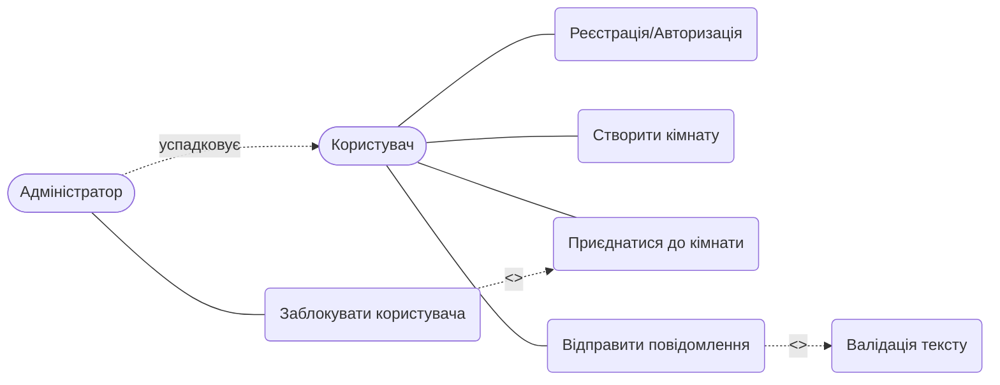

```mermaid
flowchart LR
    %% Актори
    User([Користувач])
    Admin([Адміністратор])

    Admin -.->|успадковує| User

    %% Use Cases
    UC1(Реєстрація/Авторизація)
    UC2(Створити кімнату)
    UC3(Приєднатися до кімнати)
    UC4(Відправити повідомлення)
    UC5(Валідація тексту)
    UC6(Заблокувати користувача)

    %% Зв'язки Актор -> UC
    User --- UC1
    User --- UC2
    User --- UC3
    User --- UC4

    Admin --- UC6

    %% Include / Extend
    UC4 -.->|"<<include>>"| UC5
    UC6 -.->|"<<extend>>"| UC3
```